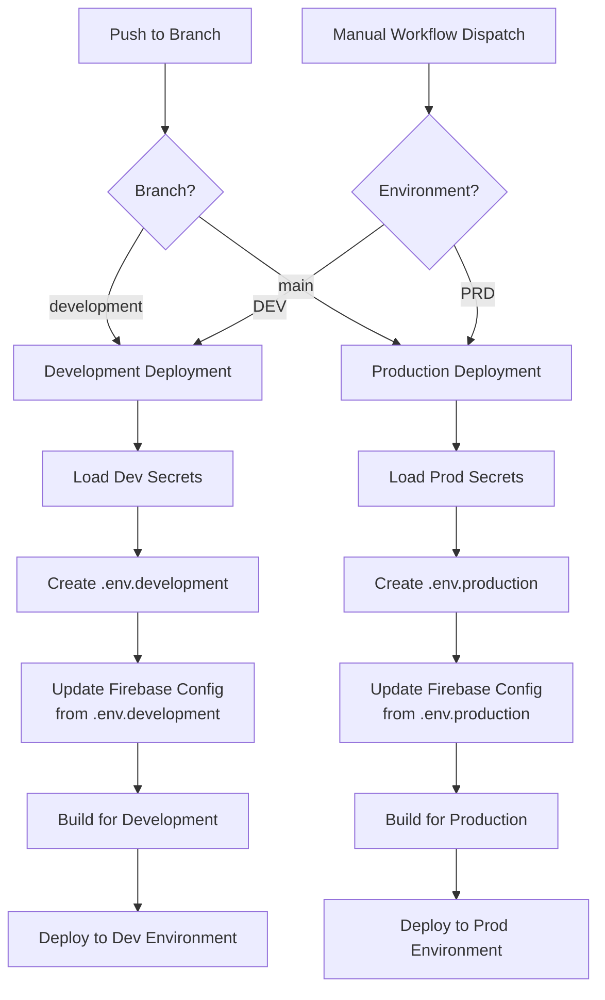

# GitHub Workflow for Firebase Configuration

This document explains how the GitHub Actions workflow securely handles Firebase configuration.

## Workflow Diagram



## Security Flow

The workflow uses a secure approach for handling sensitive configuration:

1. **Secret Storage**: 
   - All sensitive configuration is stored in GitHub Secrets
   - Environment-specific secrets are stored in GitHub Environments

2. **Environment Generation**:
   - GitHub Actions generates the appropriate `.env` file during the workflow run
   - These files are never committed to the repository

3. **Configuration Update**:
   - The `update-firebase-config.js` script reads from the generated `.env` file
   - Updates Firebase Functions configuration securely

4. **Clean Up**:
   - The `.env` files are automatically destroyed when the workflow completes
   - No sensitive data is persisted in the repository

## Required GitHub Secrets

### Repository Secrets

- `FIREBASE_TOKEN`: Firebase CI token for authentication

### Environment-Specific Secrets (Development & Production)

- `FIREBASE_PROJECT_ID`: Firebase project ID
- `FIREBASE_API_KEY`: Firebase API key
- `FIREBASE_AUTH_DOMAIN`: Firebase authentication domain
- `FIREBASE_STORAGE_BUCKET`: Firebase storage bucket
- `FIREBASE_MESSAGING_SENDER_ID`: Firebase messaging sender ID 
- `FIREBASE_APP_ID`: Firebase application ID
- `FIREBASE_MEASUREMENT_ID`: Firebase Google Analytics measurement ID

## Setup Instructions

1. **Generate Firebase Token**:
   ```bash
   firebase login:ci
   ```

2. **Configure GitHub Repository**:
   1. Go to your repository settings
   2. Navigate to Secrets and variables > Actions
   3. Add the repository secrets

3. **Configure GitHub Environments**:
   1. Go to your repository settings
   2. Navigate to Environments
   3. Create "development" and "production" environments
   4. Add the environment-specific secrets to each

## Troubleshooting

- **Authentication Errors**: Verify that your `FIREBASE_TOKEN` is valid and has necessary permissions
- **Configuration Errors**: Check that all required secrets are properly set in GitHub
- **Deployment Errors**: Examine the GitHub Actions logs for specific error messages 